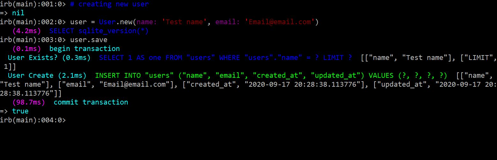
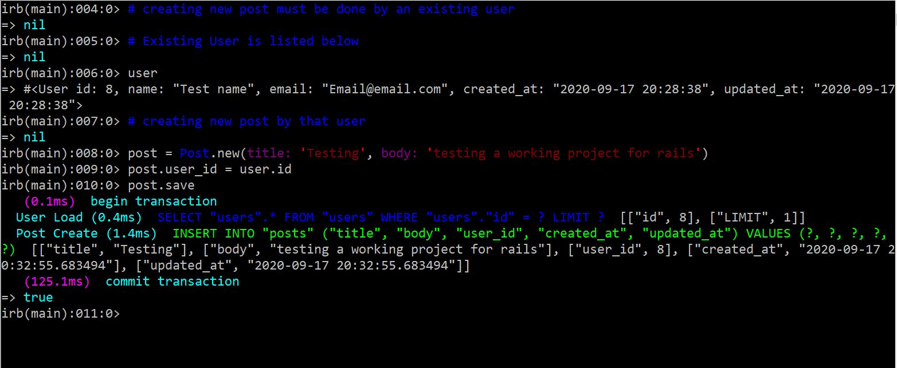
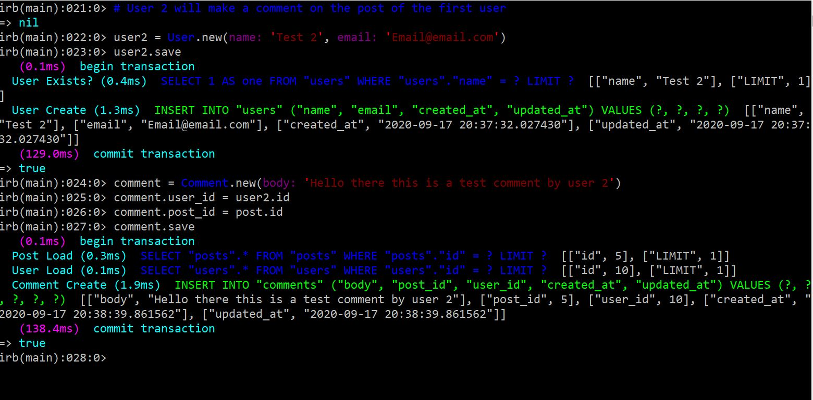
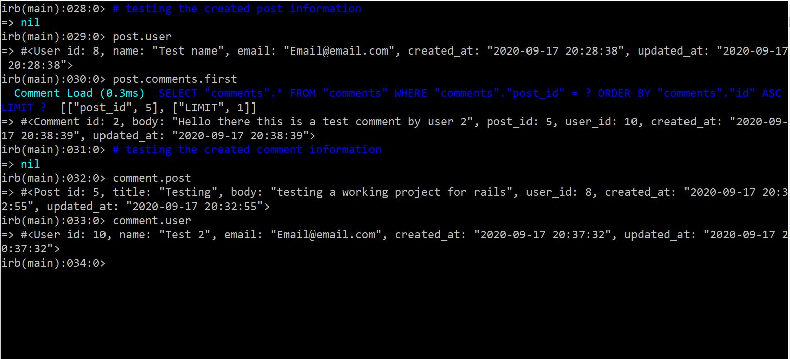

# Micro Reddit
> This is a Microverse, Technical curriculum, Ruby on Rails Micro-Reddit backend.

## Sample Screenshot

## Built With

- Ruby on Rails
- sqlite3 for the local development
- VScode

## Instructions
* 1. Install: [Ruby Developer kit](https://rubyinstaller.org/downloads/)
* 2. gem install rails -v 6.0.0 (or higher) |cmd command|
* 3. gem update |cmd command|
* 4. Change directory to the project folder
* 5. Run `bundle` 
* 6. Run `rails c` to test the project
## Author

👤 **Bereket Beshane**

- Github: [@berabjesus](https://github.com/Berabjesus)
- Twitter: [@bereket_ababu_b](https://twitter.com/bereket_ababu_b)
- Linkedin: [linkedin](https://www.linkedin.com/in/bereket-beshane-a1b75a1a9/)

👤 **Miguel Angel Enciso Sanchez**

- Github: [@rootDEV2990](https://github.com/rootDEV2990)
- Twitter: [@m29902](https://twitter.com/m29902)
- Linkedin: [linkedin](https://www.linkedin.com/in/miguel-enciso-6474741a1/)
- Medium: [medium](https://medium.com/@website.dev)

## 🤝 Contributing

Contributions, issues and feature requests are welcome!

## Show your support

Give a ⭐️ if you like this project!

## Acknowledgments

- Microverse
- Heroku
## 📝 License

This project is [MIT](LICENSE) licensed.

